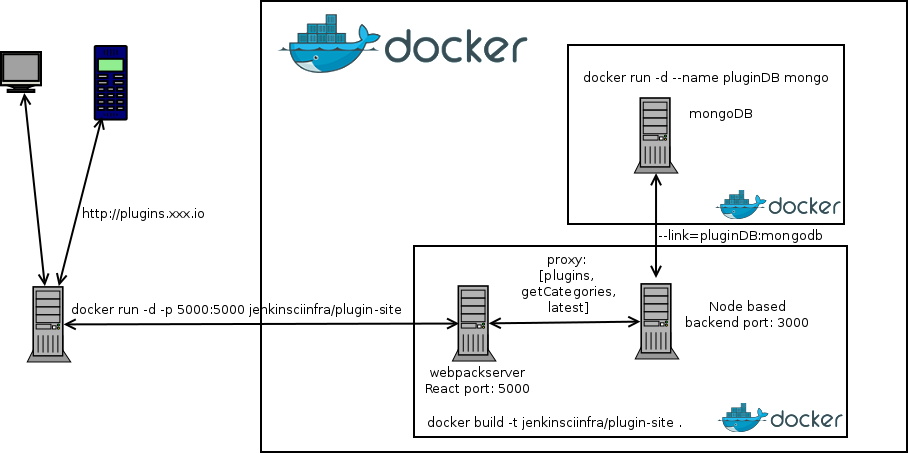

# Jenkins plugin site
This is a simple rendering of the plugin list as taken from updates.jenkins-ci.org/current/update-center.json.

# Architecture in deploy



We have 2 docker images, one is a vanilla mongodb image and the other our plugin-site (see below how to 
build it with docker).

Under the hood we have two services running one on port 3000 and another on 5000 on our docker image.
 
The 3000 is communicating with mongo and doing the indexing work of the plugins. In the initial connect of that service 
with the db we are requesting the jsonp from the official site and indexing our mongodb with it. 
We further created a cron job in that server to index the plugins once a day at 1:1:1. 
On the port 5000 service we created a proxy to mask the other service (port 3000) and to make it impossible to trigger 
the re-index of the plugins from outside (magic url -> /indexDb). 

The only visible service it the react app served from a webpack server (and some proxy magic to access
[plugins, getCategories, latest] without exposing the backend). 

Besides the docker images there is nothing to be installed on any hosting service only a http proxy 
to do plugins.xxx.io -> x.x.x.x:5000 ...and of course docker.


### Run with Docker

```
docker pull mongo
docker run -d --name pluginDB mongo

docker build -t jenkinsciinfra/plugin-site .
docker run -d -p 5000:5000 --link=pluginDB:mongodb --name plugin-site jenkinsciinfra/plugin-site
Point to http://0.0.0.0:5000/
```

### Usage with npm


```
npm install
npm start
Open http://localhost:5000
```

### Code Integrity

To test the integrity of our code base we are using a compination of eslint and tests.

```
npm run integrity
```

To make sure you do not push faulty code we create as well a pre-push hook which will call the test. However since we
are using the Jenkinsfile to describe our deploy pipeline, we added the check in the commit stage.

However fell free to activate it with:

```
ln -s `pwd`/pre-push.sh .git/hooks/pre-push
```

### Linting with npm

ESLint with React linting options have been enabled.

```
npm run lint
```

You can use the command lint:fix and it will try to fix all
offenses, whoever there maybe some more that you need to fix manually.

Remember:

```
npm run [command] [-- <args>]
```

Note the necessary --. So in package.json we have:

```
"lint:fix": "npm run lint -- --fix"
```

### Testing

We have created different test environments that you can us during development.

#### TDD support via watch

```
npm run test:watch
```

Can be used for TDD with a rapid feedback loop (as soon you save all tests will run)

#### Debug Tests in a Browser

Mocha tests typically use require statements and often access the file system,
so running them directly in the browser is challenging.
The next best thing is to use node-inspector, which connects a version of the
Chrome dev tools to the Node runtime used by Mocha.

To use this (only once):

```
npm install -g node-inspector

```
Then you can use:

```
npm run test:debug
```

Then run node-inspector. It will prompt you to open a browser at a debug URL.
From there, you can set breakpoints and inspect variables in the same way
you would in the Chrome Dev Tools.
